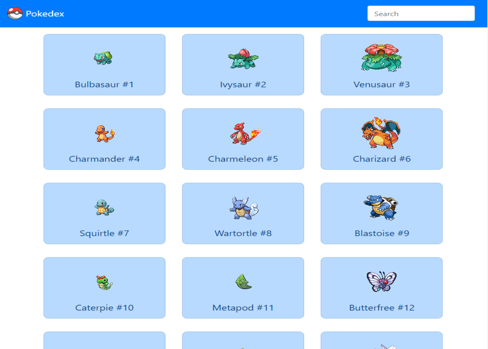

# Pokedex App

## Description

The Pokedex app fetches data from the [PokeAPI](https://pokeapi.co/) for the first 493 Pokemon i.e. Generations 1-4. It displays each pokemon as a list of buttons that when clicked activate a modal that shows a more detailed description of that pokemon. The user can also use the search bar to filter the list of pokemon by name.

## Screenshots

## Technologies

- HTML5
- CSS3
- Javascript ES6
- jQuery 3.3.1
- Bootstrap 4.3.1

